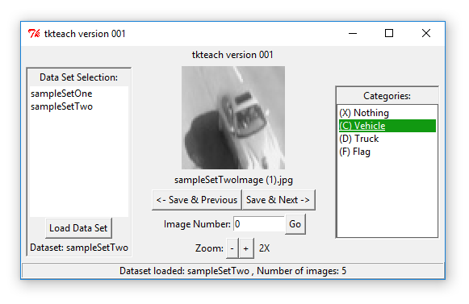

# tkteach
A Super Fast Image Categorization Tool Written in Python
-------------------------------------------------------------

tkteach is a graphical tool that lets you quickly flip through datasets of images to categorize them.

Features
----------

- Easily customizable categories and keyboard shortcuts
- Categorization can be done with arrow keys and keyboard shortcuts for improved speed, OR can be done with the mouse
- Category labels saved to sqLite database for easy retrieval
- Operates on one or more user-collected datasets of images
- Images can be zoomed in or out
- Allows multiple categorizations per image
- Category labels can be reviewed from within the application

About
-----------

- Tested in both Python 2.7 and 3.6
- Requires PIL, sqlite3, and tkiner or Tkinter
